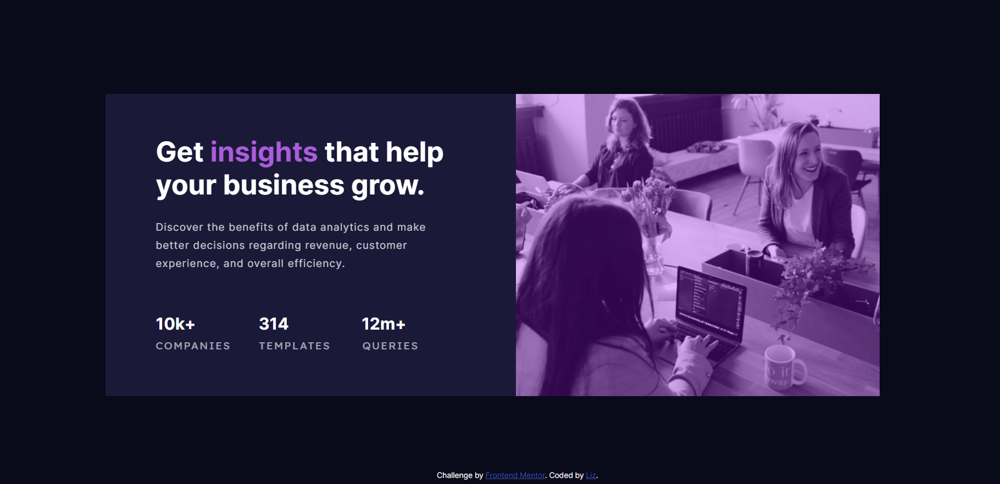

# Frontend Mentor - Stats preview card component solution

This is a solution to the [Stats preview card component challenge on Frontend Mentor](https://www.frontendmentor.io/challenges/stats-preview-card-component-8JqbgoU62). Frontend Mentor challenges help you improve your coding skills by building realistic projects. 

## Overview

### The challenge

Users should be able to:

- View the optimal layout depending on their device's screen size

### Screenshot

### Links

- Solution URL: https://www.frontendmentor.io/solutions/stats-preview-card-component-using-htmlcss-TmLchcMX0
- Live Site URL: https://ell65.github.io/stats-card/

### What I learned

Every line of code in this project is something I learned for the first time this week! :)

### Continued development

I am particularly enthusiastic about learning responsive design. I was introduced to this topic via a twitter thread and it is what got me curious enough to build this project to begin with!

This project did not focus on the mobile design challenge, but I am learning about adapting to a mobile format. 

## Author

- Website - Elizabeth Lentine (https://www.linkedin.com/in/elizabeth-lentine)
- Frontend Mentor - [@ell65](https://www.frontendmentor.io/profile/ell65)
- Twitter - [@elentine99](https://www.twitter.com/elentine99)
